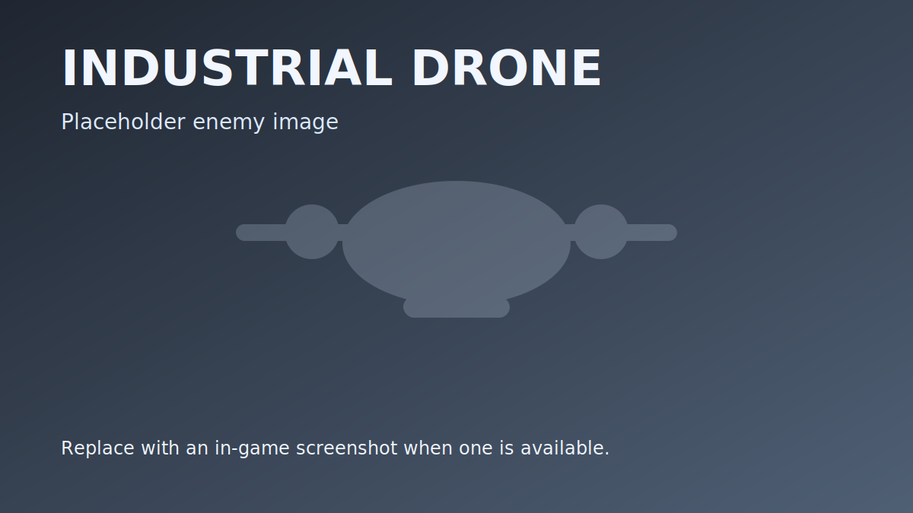
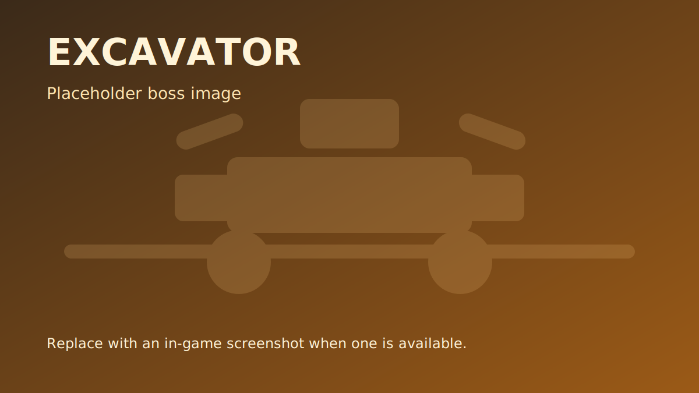
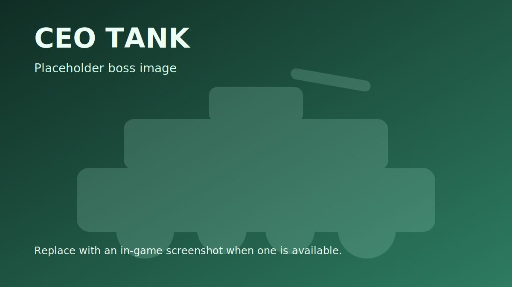

# Enemies and Bosses

Enemy pressure changes a lot as a run goes deeper. Kweebec opens with DeadWood swarms and wildlife, Desert pushes much harder on industrial troops, and Toxic finishes the run with Drones, ranged Hazmat variants, and the CEO Tank.

Each floor ends with its own boss, and every major enemy family behaves a little differently in a fight. This page is the quick reference for what you are actually up against.

---

## Enemy Progression

| Floor | Main Pressure | Boss |
|-------|---------------|------|
| Kweebec | DeadWood packs, wolves, light industrial support | Forklift |
| Desert | Mixed DeadWood and industrial control | Excavator |
| Toxic | Heavy industrial roster, ranged Hazmats, Drones | CEO Tank |

---

## DeadWood Enemies

DeadWood are corrupted Kweebec enemies and they make up most early fights. Even on later floors they still show up often enough to punish overconfidence, especially when they arrive alongside industrial enemies.

### Rootlings

_DeadWood Rootling - the most common enemy type_

Medium-sized DeadWood and the most common melee body in the early floors.

| Variant | Weapon | Spawn Weight |
|---------|--------|-------------|
| Rootling | Unarmed | 10 |
| Rootling (Sword) | Sword | 5 |
| Rootling (Axe) | Axe | 5 |
| Rootling (Lance) | Lance | 5 |

- Detection range: 30 blocks
- Alert range: 54 blocks

### Sproutlings

_DeadWood Sproutling - smaller and faster than Rootlings_

Smaller and faster than Rootlings. They pressure the backline well when mixed into larger packs.

| Variant | Weapon | Spawn Weight |
|---------|--------|-------------|
| Sproutling | Unarmed | 10 |
| Sproutling (Sword) | Sword | 5 |
| Sproutling (Axe) | Axe | 5 |
| Sproutling (Lance) | Lance | 5 |

### Seedlings

_DeadWood Seedling - larger DeadWood with more health_

Smaller DeadWood less common than Rootlings and Sproutlings.

| Variant | Spawn Weight |
|---------|-------------|
| DeadWood Seedling | 4 |

### DeadWood Drops

| Drop | Chance | Amount |
|------|--------|--------|
| Coins | 45% | 1-3 |
| Ammo | 16% | 1 |
| Healing | 12% | 1 |

---

## Wildlife

### Radioactive Wolf

_Radioactive Wolf - fast pack hunter_

Fast pack hunters that close distance quickly and punish anyone who drifts away from the group.

| Stat | Value |
|------|-------|
| Health | 103 HP |
| Damage | 27 (Wolf Bite, +/-10%) |
| Speed | Inherited from Wolf_Black template |
| Spawn Weight | 5 |

| Drop | Chance | Amount |
|------|--------|--------|
| Coins | 50% | 1-3 |
| Ammo | 18% | 1 |
| Healing | 14% | 1 |

---

## Industrial Enemies

Industrial enemies become the dominant threat from Desert onward. They hit harder, hold range better, and usually create more room pressure than the DeadWood they fight beside.

### Nosuit

_Industrial Nosuit - unarmored worker enemy_

Unarmored industrial workers. They are the most basic industrial body, but they show up often enough that they become the glue holding mixed enemy packs together.

| Stat | Value |
|------|-------|
| Speed | 6.9 |
| Detection | 28 blocks |
| Alert Range | 54 blocks |
| Spawn Weight | 3 |

### Hazmat

_Industrial Hazmat - close range industrial enemy_

The core Hazmat enemy. It wants to stay close and keep pressure on the party while ranged variants make the room worse.

| Stat | Value |
|------|-------|
| Spawn Weight | 5 in Desert, 8 in Toxic |
| Attack Type | Melee |

### Hazmat (FlameThrower)

_Industrial Hazmat (FlameThrower) - ranged industrial enemy_

A Hazmat variant that floods nearby space with flame damage. It is especially dangerous in narrow corridors and during challenge waves.

| Stat | Value |
|------|-------|
| Spawn Weight | 2 in Desert, 3 in Toxic |
| Attack Type | Ranged flames projectile |

### Hazmat (Toxic Launcher)

_Industrial Hazmat (Toxic Launcher) - ranged industrial enemy_

A ranged industrial enemy that becomes part of the normal mob pool in Desert and Toxic. It forces movement by throwing toxic shots into longer lanes.

| Stat | Value |
|------|-------|
| Spawn Weight | 2 in Desert, 3 in Toxic |
| Attack Type | Ranged toxic projectile |

### Industrial Drone

_Industrial Drone - placeholder image_

A flying industrial support enemy that starts defining the Toxic floor. Drones attack from above, throw radioactive barrels, and can dash into better angles when the party tries to hide behind terrain.

| Stat | Value |
|------|-------|
| Health | 80 HP |
| Speed | 8.0 |
| View Range | 30 blocks |
| Alert Range | 54 blocks |
| Attack Range | 15 blocks |
| Spawn Weight | 3 in Toxic |

> **Note:** Industrial Drones can also appear in some altar and challenge encounters before Toxic, but Toxic is the first floor where they become part of the regular room identity.

### Industrial Drops

| Drop | Chance | Amount |
|------|--------|--------|
| Coins | 55% | 1-4 |
| Ammo | 20% | 1 |
| Healing | 15% | 1 |

---

## Bosses

Each floor ends with a boss fight. Defeating the boss moves the run forward and also contributes to the Rift Merchant trophy unlocks outside the dungeon.

### Boss: Forklift

A massive industrial machine that charges at players with devastating speed.

_Boss Forklift_

| Stat | Value |
|------|-------|
| Health | 2,500 HP |
| Speed | 7.5 |
| Detection | 22 blocks |
| Alert Range | 28 blocks |

#### Attack Patterns

| Attack | Description | Damage |
|--------|-------------|--------|
| Fork Attack | Double melee strike | 15 x2 |
| Turn Single | 360 degree sweep | Multiple hits |
| Turn Double | Double sweep rotation | Multiple hits |
| Leap Attack | 7.2 block distance leap | Area impact |
| Dash Attack | 6-hit dash (0.24s intervals) | 15 per hit |
| Barrel Toss | Throws radioactive barrel | Projectile damage |
| Charge | High-speed bull rush | Contact damage |

The Forklift moves a lot and is hard to keep in one place.

### Boss: Excavator

The Desert boss. Excavator is bigger than Forklift, covers more area with melee sweeps, and mixes movement attacks with ranged debris pressure.

_Boss Excavator - placeholder image_

| Stat | Value |
|------|-------|
| Floor | Desert |
| Health | 3,000 HP |
| Speed | 7.0 |
| Alert Range | 30 blocks |
| Preferred Combat Range | 2.5 - 5 blocks |

#### Attack Patterns

| Attack | Description |
|--------|-------------|
| Smash Attack | Heavy close-range slam |
| Big Arm Attack | Wide sweep with strong area pressure |
| Small Arm Attack | Faster close-range follow-up hit |
| Spin Attack | Rotating melee attack around the boss |
| Leap Attack | Gap-closing jump into the party |
| Dash Attack | Straight-line burst to punish spacing |
| Dirt Throw | Ranged debris attack |

Excavator is the boss that teaches the party to stop hugging the same angle. If everyone stacks too tightly, the melee sweeps and spin attacks get much worse.

### Boss: CEO Tank

The Toxic boss and the final fight of the current run. CEO Tank is a full multi-phase boss built around long-range pressure, artillery-style zoning, and a much longer health bar than the earlier bosses.

_Boss CEO Tank - placeholder image_

| Stat | Value |
|------|-------|
| Floor | Toxic |
| Health | 6,000 HP |
| Speed | 5.0 |
| Alert Range | 32 blocks |
| Fight Type | 3-phase boss encounter |

#### Attack Patterns

| Attack | Description |
|--------|-------------|
| Cannon Shot | Core ranged tank shell |
| Artillery Shot | Long-range bombardment pressure |
| Turret Spin | Rotating close-range threat |
| Turret Spin Shoot | Rotating fire pattern while moving the turret |
| Dash Attack | Sudden reposition and collision pressure |
| Bazooka Barrage | Added in later phases for heavier area denial |
| Machinegun Attack | Sustained bullet pressure in phase 3 |
| Mad Machinegun | More aggressive machinegun pattern in the final phase |

CEO Tank escalates as its health drops. The early phase leans on cannon, artillery, turret pressure, and dashes. Later phases add bazooka and machinegun patterns, making the arena steadily harder to control.

#### Boss Rewards

| Drop | Chance | Amount |
|------|--------|--------|
| Coins | 100% | 8-14 |
| Ammo | 70% | 1 |
| Healing | 55% | 1 |

Every boss also feeds the Rift Merchant trophy track tied to its floor.

---

## Ally NPCs

A friendly NPC can fight alongside the player:

### Kweebec Seedling (Ally)

A small ally summoned by the Kweebec Launcher. It rushes enemies and explodes on contact.

_Friendly Kweebec Seedling - summoned by the Kweebec Launcher_

| Stat | Value |
|------|-------|
| Health | 36 HP |
| Speed | 7.5 |
| Lifetime | 600 seconds |
| Leash Range | 56 blocks |
| Combat Style | Aggressive rush (24 moving weight) |
| Friendly Fire | Cannot damage players or allies |

---

## Enemy Comparison Table

| Enemy | Health | Main Threat | Floor |
|-------|--------|-------------|-------|
| DeadWood Rootling | - | Basic melee pressure | 1 - 3 |
| DeadWood Sproutling | - | Fast melee pressure | 1 - 3 |
| DeadWood Seedling | - | Heavier frontline body | 1 - 3 |
| Kweebec Seedling | - | Explosive rush | 1 - 3 |
| Radioactive Wolf | 103 | Fast pack attack | 1 - 3 |
| Industrial Nosuit | - | Reliable industrial pressure | 1 - 3 |
| Industrial Hazmat | - | Melee bruiser | 2 - 3 |
| Industrial Hazmat (Flamethrower) | - | Area denial at close-to-mid range | 2 - 3 |
| Industrial Hazmat (Toxic Launcher) | - | Toxic projectile pressure | 2 - 3 |
| Industrial Drone | 80 | Flying barrel throws and dashes | 3 |
| Forklift | 2,500 | Fast charges and melee sweeps | Boss |
| Excavator | 3,000 | Heavy melee area control | Boss |
| CEO Tank | 6,000 | Multi-phase artillery and turret pressure | Boss |

---

## Related Pages

- [Dungeon Levels](dungeon-levels-1) - Where each enemy spawns
- [Weapons](weapons-1) - What to fight them with
- [Loot and Crates](loot-and-crates-1) - Enemy and crate drop tables
- [Getting Started](getting-and-started-1) - Combat basics
